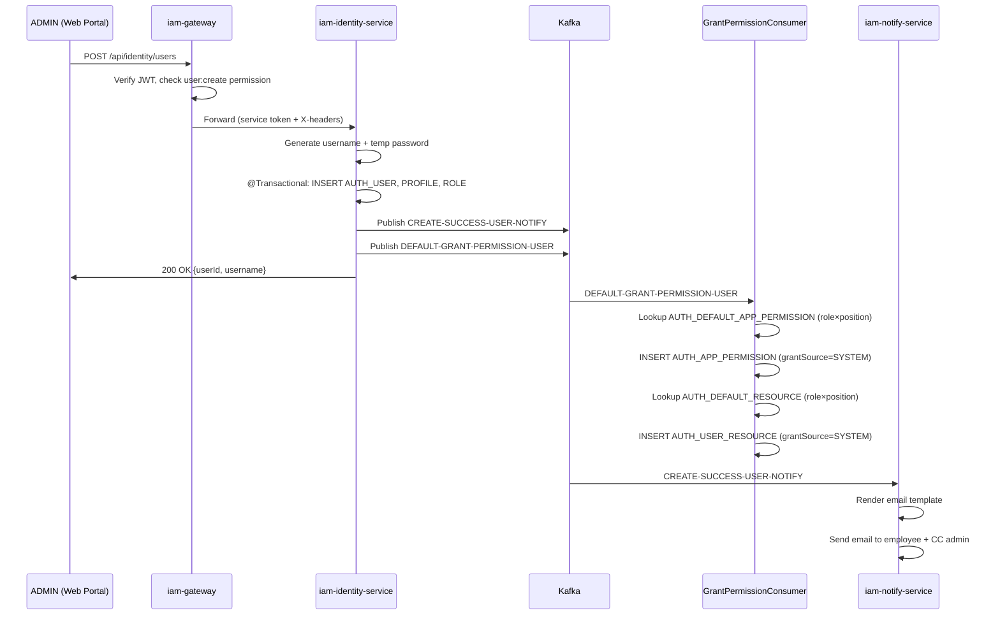

# Luồng 1: Nhân viên mới — Tạo tài khoản & Cấp quyền tự động

---

## 1. Tình huống (Scenario)

**Bối cảnh:** Phòng CNTT vừa tuyển dụng một kỹ thuật viên cấp 2 mới là **Nguyễn Văn An** (mã NV: `EMP_00123`). ADMIN hệ thống cần tạo tài khoản IAM cho nhân viên này để anh có thể truy cập vào các hệ thống nội bộ ngay trong ngày đầu làm việc.

**Yêu cầu nghiệp vụ:**
- Tài khoản tự động được sinh username và mật khẩu tạm — không yêu cầu nhân viên tự đăng ký
- Quyền truy cập ban đầu được cấp tự động dựa trên **role × vị trí** của nhân viên (không cần xin từng app một)
- Nhân viên nhận email chào mừng kèm thông tin đăng nhập

**Những người tham gia:**

| Tác nhân | Vai trò |
|---|---|
| ADMIN | Tạo tài khoản trên portal IAM |
| Nguyễn Văn An | Nhân viên mới — đối tượng được cấp quyền |
| iam-web-service | Giao diện điều hành của ADMIN |
| iam-gateway | Xác thực JWT + kiểm tra quyền ADMIN |
| iam-identity-service | Xử lý logic tạo user + publish Kafka events |
| iam-notify-service | Nhận Kafka event → gửi email chào mừng |
| GrantPermissionConsumer (trong iam-identity) | Nhận Kafka event → cấp quyền mặc định theo role×position |

---

## 2. Trạng thái các đối tượng

### Trước khi tạo

| Entity | Trạng thái |
|---|---|
| AUTH_USER | Chưa tồn tại |
| AUTH_USER_PROFILE | Chưa tồn tại |
| AUTH_USER_ADDRESS | Chưa tồn tại |
| AUTH_USER_ROLE | Chưa tồn tại |
| AUTH_APP_PERMISSION | Chưa tồn tại |
| AUTH_USER_RESOURCE | Chưa tồn tại |

### Sau khi hoàn thành luồng

| Entity | Trường | Giá trị |
|---|---|---|
| AUTH_USER | STATUS | `ACTIVE` |
| AUTH_USER | USERNAME | `annv` (auto-generated từ fullName) |
| AUTH_USER | PASSWORD | BCrypt hash của mật khẩu tạm |
| AUTH_USER_PROFILE | POSITION_CODE | `IT_L2` |
| AUTH_USER_PROFILE | EMPLOYEE_CODE | `EMP_00123` |
| AUTH_USER_PROFILE | DEPARTMENT_ID | ID phòng CNTT |
| AUTH_USER_ROLE | ROLE_ID / STATUS | `STAFF` / `ACTIVE` |
| AUTH_APP_PERMISSION | APP_ID / STATUS / GRANT_SOURCE | Các app mặc định STAFF×IT_L2 / `ACTIVE` / `SYSTEM` |
| AUTH_USER_RESOURCE | RESOURCE_ID / STATUS / GRANT_SOURCE | Các resource mặc định STAFF×IT_L2 / `ACTIVE` / `SYSTEM` |

**Quyền mặc định cho STAFF + IT_L2 (ví dụ):**

| App / Resource | Action | Nguồn |
|---|---|---|
| `iam-service` | (app permission — truy cập portal) | `SYSTEM` |
| `iam-service/user` | `read` | `SYSTEM` |
| `iam-service/user-permission` | `read`, `create` | `SYSTEM` |
| `change-mgmt` | (app permission) | `SYSTEM` |
| `change-mgmt/change-request` | `read`, `create` | `SYSTEM` |

---

## 3. Luồng theo thời gian

```
[ADMIN — iam-web-service Angular]
  Bước 1: Vào /users/create
          Điền form:
            fullName    = "Nguyễn Văn An"
            dob         = 1995-03-15
            email       = an.nguyen@bank.vn
            emailPersonal = annv.personal@gmail.com
            phone       = 0912345678
            positionCode = IT_L2
            departmentId = DEPT_IT_DEV (chọn từ dropdown phòng ban)
            roleIds     = [STAFF]
            địa chỉ thường trú: tỉnh Hà Nội, phường Thanh Xuân Trung
          → Nhấn "Tạo tài khoản"

  Bước 2: Angular gọi POST /api/identity/users
          Authorization: Bearer <ADMIN_ACCESS_TOKEN>
          Body: {fullName, dob, email, emailPersonal, phone,
                 positionCode, departmentId, roleIds:[STAFF_ID], addresses:[...]}

[iam-gateway — port 8080]
  Bước 3: PermissionCheckFilter — parse JWT, kiểm tra:
          "iam-service/user:create" ∈ permissions claim → OK
  Bước 4: UserContextFilter — inject headers:
          X-User-Id: ADMIN_ID
          X-Username: admin_system_dev
          X-User-Role: ADMIN
  Bước 5: TokenExchangeFilter — thay access_token bằng service token (client_credentials)
          → Forward tới iam-identity-service:8081

[iam-identity-service — UserInfoController]
  Bước 6: CheckInfor.checkDuplicatedDataUser()
          → SELECT COUNT FROM AUTH_USER WHERE EMAIL = 'an.nguyen@bank.vn'
          → 0 → OK (không trùng)

  Bước 7: GenDataService.genUsername("Nguyễn Văn An")
          → Bỏ dấu: "nguyen van an"
          → Format: tên + chữ đầu họ+đệm = "annv"
          → SELECT COUNT FROM AUTH_USER WHERE USERNAME = 'annv' → 0 → dùng "annv"

  Bước 8: GenDataService.genPassword()
          → Random string 10 ký tự: "X7k!mQp2Rn"

  Bước 9: BCryptPasswordEncoder.encode("X7k!mQp2Rn")
          → "$2a$10$AbcDefGhi..."

  Bước 10: @Transactional — SavedService.createUser():
           INSERT AUTH_USER:
             USER_ID   = UUID ngẫu nhiên (e.g. "usr_abc123")
             USERNAME  = "annv"
             EMAIL     = "an.nguyen@bank.vn"
             PASSWORD  = "$2a$10$AbcDefGhi..."
             STATUS    = "ACTIVE"
             CREATED_AT = NOW()

           INSERT AUTH_USER_PROFILE:
             USER_ID       = "usr_abc123"
             EMPLOYEE_CODE = "EMP_00123"
             FULL_NAME     = "Nguyễn Văn An"
             POSITION_CODE = "IT_L2"
             DEPARTMENT_ID = DEPT_IT_DEV_ID
             EMAIL_PERSONAL = "annv.personal@gmail.com"
             JOIN_DATE     = 2026-06-07
             ON_LEAVE      = false

           INSERT AUTH_USER_ADDRESS (PERMANENT):
             USER_ID   = "usr_abc123"
             TYPE      = "PERMANENT"
             PROVINCE_CODE = "01" (Hà Nội)
             WARD_CODE = "00..."
             ADDRESS_DETAIL = "..."

           INSERT AUTH_USER_ROLE:
             USER_ID = "usr_abc123"
             ROLE_ID = STAFF_ROLE_ID
             STATUS  = "ACTIVE"
             CREATED_AT = NOW()

           COMMIT — kết thúc @Transactional

  Bước 11: Kafka publish — ngoài @Transactional, wrapped try-catch:

           Topic: CREATE-SUCCESS-USER-NOTIFY
           Payload:
             {
               userId: "usr_abc123",
               fullName: "Nguyễn Văn An",
               username: "annv",
               emailPersonal: "annv.personal@gmail.com",
               tempPassword: "X7k!mQp2Rn",
               joinDate: "2026-06-07"
             }

           Topic: DEFAULT-GRANT-PERMISSION-USER
           Payload:
             {
               userId: "usr_abc123",
               roles: ["STAFF"],
               positionCode: "IT_L2",
               departmentId: DEPT_IT_DEV_ID
             }

  Bước 12: Trả về HTTP 200
           Response: {userId, username, employeeCode, message: "Tạo user thành công"}

[ADMIN] → Angular navigate về /users, thông báo thành công

──────────────────────────────────────
[Kafka Consumer — GrantPermissionConsumer (iam-identity-service)]
──────────────────────────────────────

  Bước 13: @KafkaListener("DEFAULT-GRANT-PERMISSION-USER")
           Nhận payload: {userId:"usr_abc123", roles:["STAFF"], positionCode:"IT_L2", ...}

  Bước 14: Lookup quyền app mặc định:
           SELECT * FROM AUTH_DEFAULT_APP_PERMISSION
           WHERE ROLE_ID = STAFF_ROLE_ID AND POSITION_CODE = 'IT_L2'
           AND STATUS = 'ACTIVE'
           → Kết quả: [app_id=IAM_APP_ID, app_id=CHANGE_MGMT_APP_ID]

  Bước 15: INSERT AUTH_APP_PERMISSION cho mỗi app:
           (userId="usr_abc123", appId=IAM_APP_ID,
            status="ACTIVE", grantSource="SYSTEM",
            grantedAt=NOW())

           (userId="usr_abc123", appId=CHANGE_MGMT_APP_ID,
            status="ACTIVE", grantSource="SYSTEM",
            grantedAt=NOW())

  Bước 16: Lookup quyền resource mặc định:
           SELECT * FROM AUTH_DEFAULT_RESOURCE
           WHERE ROLE_ID = STAFF_ROLE_ID AND POSITION_CODE = 'IT_L2'
           AND STATUS = 'ACTIVE'
           → Kết quả: [iam-service/user:read, iam-service/user-permission:read,create,
                        change-mgmt/change-request:read,create]

  Bước 17: INSERT AUTH_USER_RESOURCE cho mỗi resource:
           (userId="usr_abc123", resourceId=USER_RESOURCE_ID,
            actions="read", status="ACTIVE", grantSource="SYSTEM")

           (userId="usr_abc123", resourceId=USER_PERMISSION_RESOURCE_ID,
            actions="read,create", status="ACTIVE", grantSource="SYSTEM")

           (userId="usr_abc123", resourceId=CHANGE_REQUEST_RESOURCE_ID,
            actions="read,create", status="ACTIVE", grantSource="SYSTEM")

  Bước 18: ack.acknowledge() — commit Kafka offset

──────────────────────────────────────
[Kafka Consumer — NotifyConsumer (iam-notify-service)]
──────────────────────────────────────

  Bước 19: @KafkaListener("CREATE-SUCCESS-USER-NOTIFY")
           Nhận payload: {userId, fullName, username, emailPersonal, tempPassword, joinDate}

  Bước 20: JPA lookup emailPersonal:
           SELECT EMAIL_PERSONAL FROM AUTH_USER_PROFILE WHERE USER_ID = 'usr_abc123'
           → "annv.personal@gmail.com"

  Bước 21: EmailService.sendUserCreatedEmail()
           → Thymeleaf render: user-created.html
             Nội dung: Chào mừng Nguyễn Văn An, tài khoản: annv, mật khẩu tạm: X7k!mQp2Rn
             Link: http://iam.bank.vn/login (đổi mật khẩu ngay)
           → JavaMailSender.send()
             To: annv.personal@gmail.com
             CC: vudinhcuong8404@gmail.com (audit trail)

  Bước 22: ack.acknowledge()

──────────────────────────────────────
[Nhân viên An — ngày đầu làm việc]
──────────────────────────────────────

  Bước 23: Nhận email → truy cập portal → đăng nhập username="annv", password="X7k!mQp2Rn"
  Bước 24: Đổi mật khẩu ngay (hệ thống khuyến nghị)
  Bước 25: Truy cập change-app (http://change.bank.vn) → PKCE redirect → đăng nhập
           JWT access_token chứa:
             "permissions": [
               "iam-service/user:read",
               "iam-service/user-permission:read",
               "iam-service/user-permission:create",
               "change-mgmt/change-request:read",
               "change-mgmt/change-request:create"
             ]
```

---

## 4. Sơ đồ tổng quan



---

## 5. Ghi chú & Ràng buộc nghiệp vụ

| Điểm | Mô tả |
|---|---|
| **grantSource = SYSTEM** | Quyền được cấp tự động theo mặc định. Khi nhân viên thay đổi role hoặc luân chuyển, các quyền này sẽ bị thu hồi cascade. |
| **Async cấp quyền** | Cấp quyền mặc định xảy ra bất đồng bộ qua Kafka. Nhân viên có thể đăng nhập ngay, nhưng quyền đầy đủ chỉ có sau vài giây khi consumer xử lý xong. |
| **Username generation** | Nếu "annv" đã tồn tại: thử "annv1", "annv2",... |
| **Mật khẩu tạm** | Chỉ gửi qua email cá nhân (emailPersonal). Mật khẩu PHẢI được đổi trước khi sử dụng lâu dài. |
| **Kafka failure** | Nếu Kafka publish thất bại: DB đã commit (user tồn tại), nhưng quyền không được cấp và email không được gửi. ADMIN phải publish lại thủ công hoặc hệ thống có retry mechanism. |
| **Quyền theo position** | Cùng role STAFF nhưng IT_L1 và IT_L2 có quyền mặc định KHÁC NHAU (cấu hình trong AUTH_DEFAULT_APP_PERMISSION và AUTH_DEFAULT_RESOURCE). |
