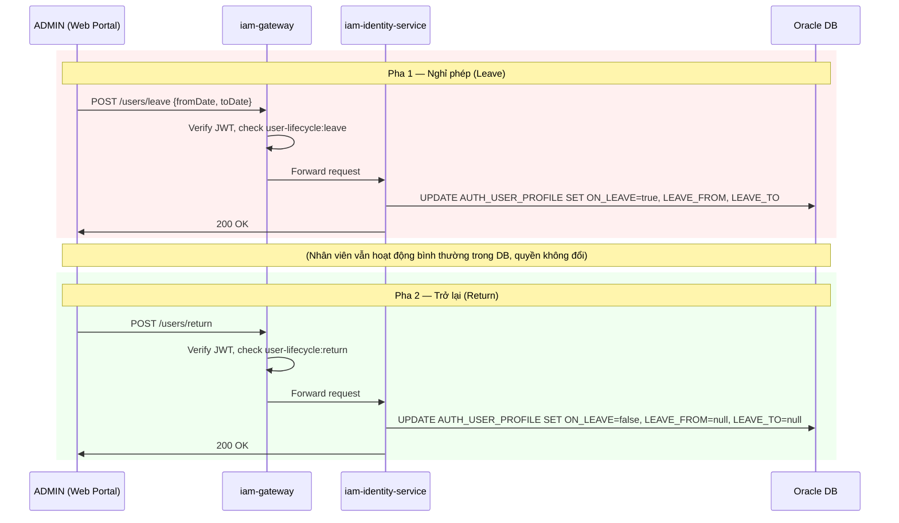

# Luồng 2: Nghỉ phép & Trở lại làm việc

---

## 1. Tình huống (Scenario)

**Bối cảnh:** Nhân viên **Nguyễn Văn An** (IT_L2, STAFF) xin nghỉ phép có lương từ 01/07/2026 đến 31/07/2026 để điều trị bệnh. ADMIN ghi nhận trạng thái nghỉ phép vào hệ thống. Sau khi hết phép, ADMIN đánh dấu nhân viên đã trở lại làm việc.

**Đặc điểm nghiệp vụ của luồng này:**
- Nghỉ phép là trạng thái **hành chính** — chỉ ghi nhận ai đang nghỉ, từ ngày nào đến ngày nào
- Quyền truy cập hệ thống **KHÔNG thay đổi** trong thời gian nghỉ phép
- Nhân viên vẫn có thể đăng nhập và truy cập hệ thống nếu cần (ví dụ: xử lý sự cố khẩn cấp)
- Đây là sự khác biệt quan trọng so với **Thôi việc** (Offboard) — thôi việc mới thu hồi quyền thực sự

**Những người tham gia:**

| Tác nhân | Vai trò |
|---|---|
| ADMIN | Ghi nhận nghỉ phép / trở lại làm việc |
| Nguyễn Văn An | Nhân viên nghỉ phép |
| iam-web-service | Giao diện thực hiện thao tác (tab Nghỉ phép) |
| iam-gateway | Xác thực JWT + kiểm tra quyền user-lifecycle |
| iam-identity-service | Cập nhật flag nghỉ phép trong DB |

---

## 2. Trạng thái các đối tượng

### Pha 1: Ghi nhận nghỉ phép (Leave)

| Entity | Trường | Trước | Sau |
|---|---|---|---|
| AUTH_USER | STATUS | `ACTIVE` | `ACTIVE` (không đổi) |
| AUTH_USER_PROFILE | ON_LEAVE | `false` | `true` |
| AUTH_USER_PROFILE | LEAVE_FROM | `null` | `2026-07-01` |
| AUTH_USER_PROFILE | LEAVE_TO | `null` | `2026-07-31` |
| AUTH_USER_ROLE | STATUS | `ACTIVE` | `ACTIVE` (không đổi) |
| AUTH_APP_PERMISSION | STATUS | `ACTIVE` | `ACTIVE` (không đổi) |
| AUTH_USER_RESOURCE | STATUS | `ACTIVE` | `ACTIVE` (không đổi) |
| AUTH_CLIENT_SESSION | STATUS | `ACTIVE` | `ACTIVE` (không đổi) |

### Pha 2: Ghi nhận trở lại (Return)

| Entity | Trường | Trước | Sau |
|---|---|---|---|
| AUTH_USER | STATUS | `ACTIVE` | `ACTIVE` (không đổi) |
| AUTH_USER_PROFILE | ON_LEAVE | `true` | `false` |
| AUTH_USER_PROFILE | LEAVE_FROM | `2026-07-01` | `null` |
| AUTH_USER_PROFILE | LEAVE_TO | `2026-07-31` | `null` |
| AUTH_APP_PERMISSION | STATUS | `ACTIVE` | `ACTIVE` (không đổi) |

---

## 3. Luồng theo thời gian

### 3A. Nghỉ phép (Leave)

```
[ADMIN — iam-web-service]
  Bước 1: Vào /users/lifecycle → Tab "Nghỉ phép"
          Tìm nhân viên An (search by empCode hoặc fullName)
          Nhấn "Ghi nhận nghỉ phép" → popup modal
          Điền:
            fromDate = 2026-07-01
            toDate   = 2026-07-31
          → Nhấn Xác nhận

  Bước 2: Angular gọi POST /api/identity/users/leave
          Authorization: Bearer <ADMIN_ACCESS_TOKEN>
          Params: ?userId=usr_abc123&employeeCode=EMP_00123
          Body: {fromDate: "2026-07-01", toDate: "2026-07-31"}

[iam-gateway]
  Bước 3: Kiểm tra permission "iam-service/user-lifecycle:leave" ∈ JWT claims → OK
  Bước 4: Inject X-headers, thay service token → forward iam-identity-service:8081

[iam-identity-service — UserLifecycleController]
  Bước 5: Validate userId + employeeCode tồn tại, status = ACTIVE
  Bước 6: UPDATE AUTH_USER_PROFILE
            SET ON_LEAVE = true,
                LEAVE_FROM = '2026-07-01',
                LEAVE_TO   = '2026-07-31',
                UPDATED_AT = NOW()
            WHERE USER_ID = 'usr_abc123'
  Bước 7: Trả về HTTP 200 {message: "Ghi nhận nghỉ phép thành công"}

[ADMIN] → Giao diện cập nhật: nhân viên An hiển thị tag "Đang nghỉ phép"
```

### 3B. Trở lại làm việc (Return)

```
[ADMIN — iam-web-service]
  Bước 1: Vào /users/lifecycle → Tab "Nghỉ phép" → Sub-tab "Tạm hoãn công tác"
          Tìm nhân viên An (onLeave=true)
          Nhấn "Ghi nhận trở lại" → confirm

  Bước 2: Angular gọi POST /api/identity/users/return
          Params: ?userId=usr_abc123&employeeCode=EMP_00123

[iam-gateway]
  Bước 3: Kiểm tra permission "iam-service/user-lifecycle:return" ∈ JWT claims → OK
  Bước 4: Forward iam-identity-service:8081

[iam-identity-service]
  Bước 5: UPDATE AUTH_USER_PROFILE
            SET ON_LEAVE  = false,
                LEAVE_FROM = null,
                LEAVE_TO   = null,
                UPDATED_AT = NOW()
            WHERE USER_ID = 'usr_abc123'
  Bước 6: Trả về HTTP 200 {message: "Ghi nhận trở lại thành công"}

[ADMIN] → Nhân viên An chuyển về tab "Đang công tác"
```

---

## 4. Sơ đồ tổng quan



---

## 5. Ghi chú & Ràng buộc nghiệp vụ

| Điểm | Mô tả |
|---|---|
| **Quyền không thay đổi** | Đây là thiết kế có chủ đích: nghỉ phép ngắn hạn không ảnh hưởng đến access control. Nhân viên vẫn có thể login và xử lý công việc từ xa nếu cần. |
| **Khác với Offboard** | Offboard (thôi việc) mới thực sự thu hồi quyền. Luồng này chỉ là flag hành chính. |
| **Không có Kafka event** | Luồng đơn giản — chỉ update DB trực tiếp, không cần notify hay cấp/thu hồi quyền. |
| **Hiển thị trên UI** | Tab "Nghỉ phép" trong UserLifecycle có 2 sub-tab: "Đang công tác" (onLeave=false, status=ACTIVE) và "Tạm hoãn công tác" (onLeave=true). |
| **Trường hợp nghỉ không lương** | Về mặt IAM, xử lý giống nghỉ có lương — chỉ là flag ON_LEAVE. Không tự động thu hồi quyền. Nếu nghỉ dài hạn cần thu hồi quyền, ADMIN phải dùng luồng Offboard. |
