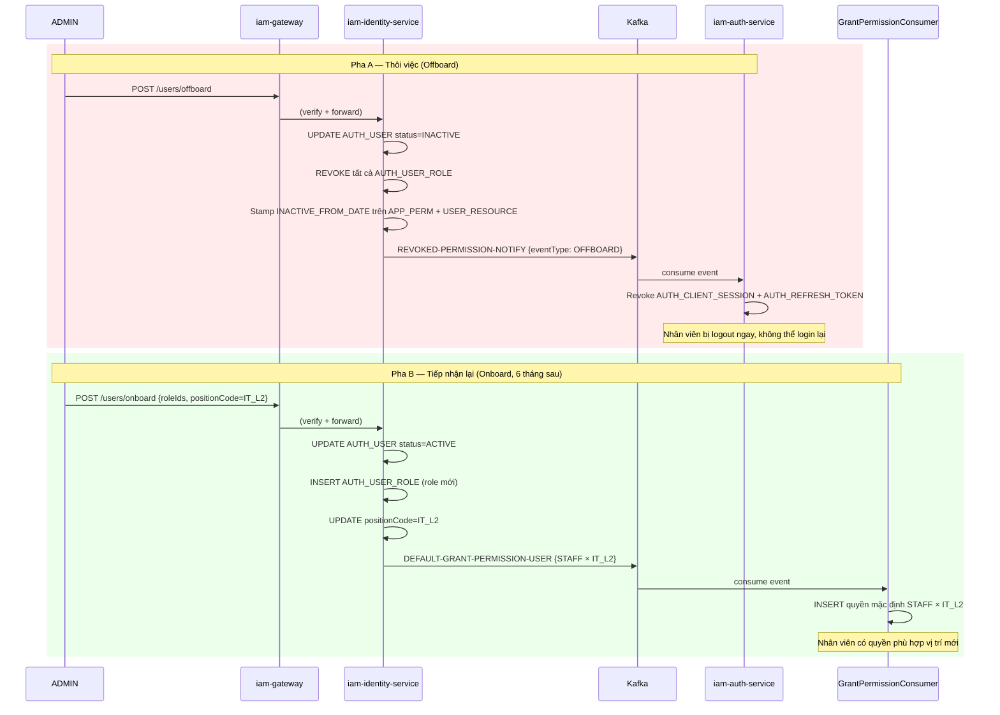

# Luồng 3: Thôi việc (Offboard) & Tiếp nhận lại (Onboard)

---

## 1. Tình huống (Scenario)

**Bối cảnh — Thôi việc:**
Nhân viên **Lê Văn Cường** (IT_L1, STAFF, mã NV: `EMP_00456`) nộp đơn xin nghỉ việc. ADMIN cần đảm bảo rằng **ngay khi nghỉ việc**, nhân viên này không còn khả năng truy cập vào bất kỳ hệ thống nào: portal IAM, change-app nội bộ, GitLab, Kibana, v.v.

**Bối cảnh — Tiếp nhận lại:**
6 tháng sau, cùng nhân viên Lê Văn Cường được tuyển dụng lại với vị trí mới là **IT_L2** (thăng cấp so với vị trí cũ IT_L1). ADMIN cần kích hoạt lại tài khoản với quyền phù hợp vị trí IT_L2 mới.

**Điểm khác biệt then chốt so với Nghỉ phép:**
- **Nghỉ phép:** quyền không thay đổi, chỉ flag hành chính
- **Thôi việc:** quyền bị **đóng băng** ngay lập tức, user không thể login

**Những người tham gia:**

| Tác nhân | Vai trò |
|---|---|
| ADMIN | Thực hiện thao tác offboard / onboard |
| Lê Văn Cường | Nhân viên thôi việc / được tiếp nhận lại |
| iam-web-service | Giao diện ADMIN (tab Biến động nhân sự) |
| iam-gateway | Kiểm tra quyền user-lifecycle |
| iam-identity-service | Cập nhật DB + publish Kafka events |
| iam-auth-service | Nhận REVOKED-PERMISSION-NOTIFY → invalidate sessions/tokens |
| GrantPermissionConsumer | Nhận DEFAULT-GRANT → cấp quyền mặc định theo vị trí mới |
| iam-notify-service | Gửi email thông báo (optional, nếu cấu hình) |

---

## 2. Trạng thái các đối tượng

### Pha A: Thôi việc (Offboard)

| Entity | Trường | Trước Offboard | Sau Offboard |
|---|---|---|---|
| AUTH_USER | STATUS | `ACTIVE` | `INACTIVE` |
| AUTH_USER_ROLE | STATUS | `ACTIVE` | `REVOKED` (tất cả roles) |
| AUTH_APP_PERMISSION | STATUS | `ACTIVE` | `ACTIVE` (giữ nguyên — lịch sử) |
| AUTH_APP_PERMISSION | INACTIVE_FROM_DATE | `null` | `2026-06-07` (đóng dấu thời điểm rời đi) |
| AUTH_USER_RESOURCE | STATUS | `ACTIVE` | `ACTIVE` (giữ nguyên — lịch sử) |
| AUTH_USER_RESOURCE | INACTIVE_FROM_DATE | `null` | `2026-06-07` |
| AUTH_CLIENT_SESSION | STATUS | `ACTIVE` | `REVOKED` (tất cả) |
| AUTH_REFRESH_TOKEN | STATUS | `ACTIVE` | `REVOKED` (tất cả) |

> **Lý do giữ AUTH_APP_PERMISSION ở STATUS=ACTIVE với inactiveFromDate:**
> Đây là thiết kế soft-delete — dữ liệu lịch sử được bảo lưu để biết nhân viên từng có quyền gì, từ ngày nào đến ngày nào. Khi nhân viên bị INACTIVE, hệ thống từ chối đăng nhập ở bước xác thực (check AUTH_USER.STATUS), không cần hard-revoke các permission records.

### Pha B: Tiếp nhận lại (Onboard) — 6 tháng sau, vị trí IT_L2

| Entity | Trường | Trước Onboard | Sau Onboard |
|---|---|---|---|
| AUTH_USER | STATUS | `INACTIVE` | `ACTIVE` |
| AUTH_USER_PROFILE | POSITION_CODE | `IT_L1` | `IT_L2` |
| AUTH_USER_ROLE | — | Không có role ACTIVE | `STAFF` / `ACTIVE` (role mới được INSERT) |
| AUTH_APP_PERMISSION | INACTIVE_FROM_DATE | `2026-06-07` | `null` (xóa ngày ngừng) |
| AUTH_APP_PERMISSION | (quyền IT_L2 mới) | Chưa có | `ACTIVE`, `grantSource=SYSTEM` |
| AUTH_USER_RESOURCE | INACTIVE_FROM_DATE | `2026-06-07` | `null` |
| AUTH_USER_RESOURCE | (quyền IT_L2 mới) | Chưa có | `ACTIVE`, `grantSource=SYSTEM` |

---

## 3. Luồng theo thời gian

### 3A. Thôi việc (Offboard)

```
[ADMIN — iam-web-service]
  Bước 1: Vào /users/lifecycle → Tab "Thôi việc"
          Tìm nhân viên Cường (empCode: EMP_00456)
          Nhấn "Xử lý thôi việc" → popup confirm
          Điền ngày thôi việc: 2026-06-07
          → Nhấn Xác nhận

  Bước 2: POST /api/identity/users/offboard
          Params: ?userId=usr_xyz789&employeeCode=EMP_00456
          Body: {offboardDate: "2026-06-07"}

[iam-gateway]
  Bước 3: Kiểm tra "iam-service/user-lifecycle:offboard" ∈ JWT → OK
  Bước 4: Forward iam-identity-service:8081

[iam-identity-service — @Transactional]
  Bước 5: Validate: userId tồn tại, status=ACTIVE
  Bước 6: UPDATE AUTH_USER
            SET STATUS = 'INACTIVE', UPDATED_AT = NOW()
            WHERE USER_ID = 'usr_xyz789'

  Bước 7: UPDATE AUTH_USER_ROLE
            SET STATUS = 'REVOKED', UPDATED_AT = NOW()
            WHERE USER_ID = 'usr_xyz789' AND STATUS = 'ACTIVE'
          → Tất cả roles của Cường bị revoke (STAFF và bất kỳ role nào khác)

  Bước 8: UPDATE AUTH_APP_PERMISSION
            SET INACTIVE_FROM_DATE = '2026-06-07', UPDATED_AT = NOW()
            WHERE USER_ID = 'usr_xyz789' AND INACTIVE_FROM_DATE IS NULL
          → Đóng dấu thời điểm ngừng quyền (dữ liệu lịch sử còn nguyên)

  Bước 9: UPDATE AUTH_USER_RESOURCE
            SET INACTIVE_FROM_DATE = '2026-06-07', UPDATED_AT = NOW()
            WHERE USER_ID = 'usr_xyz789' AND INACTIVE_FROM_DATE IS NULL
          → Tương tự

  Bước 10: COMMIT @Transactional

  Bước 11: Kafka publish (ngoài @Transactional):
           Topic: REVOKED-PERMISSION-NOTIFY
           Payload:
             {
               userId: "usr_xyz789",
               employeeCode: "EMP_00456",
               eventType: "OFFBOARD",
               revokedAt: "2026-06-07T09:00:00Z"
             }

  Bước 12: Trả về HTTP 200

──────────────────────────────────────
[iam-auth-service — PermissionRevokedConsumer]
──────────────────────────────────────

  Bước 13: @KafkaListener("REVOKED-PERMISSION-NOTIFY")
           Nhận: {userId: "usr_xyz789", eventType: "OFFBOARD"}

  Bước 14: Invalidate tất cả CLIENT SESSION:
           UPDATE AUTH_CLIENT_SESSION
             SET STATUS = 'REVOKED'
             WHERE USER_ID = 'usr_xyz789' AND STATUS = 'ACTIVE'

  Bước 15: Invalidate tất cả REFRESH TOKEN:
           UPDATE AUTH_REFRESH_TOKEN
             SET STATUS = 'REVOKED'
             WHERE USER_ID = 'usr_xyz789' AND STATUS = 'ACTIVE'

  Bước 16: ack.acknowledge()

──────────────────────────────────────
[Nhân viên Cường — lúc đang làm việc]
──────────────────────────────────────

  Bước 17a: Cường đang mở portal IAM
            → Trong vòng ≤ 1h (TTL JWT hiện tại):
              Request tới API → 401 (session revoked)
              interceptor gọi POST /auth/token (refresh)
              → 401 (refresh token đã revoked)
              → authService.logout() → redirect /login

  Bước 17b: Cường thử login lại
            → POST /login username=cuongvl, password=...
            → iam-auth: SELECT STATUS FROM AUTH_USER = 'INACTIVE'
            → Trả về lỗi "Tài khoản đã bị vô hiệu hóa"
            → Không thể đăng nhập

  Bước 17c: Cường thử đăng nhập GitLab (qua LDAP)
            → ldap-server: BIND → tìm user → STATUS = 'INACTIVE'
            → InvalidCredentialsException → GitLab báo lỗi xác thực
```

### 3B. Tiếp nhận lại (Onboard) — 6 tháng sau

```
[ADMIN — iam-web-service]
  Bước 1: Vào /users/lifecycle → Tab "Tiếp nhận"
          Tìm nhân viên Cường (lọc: offboarded=true, status=INACTIVE)
          Nhấn "Tiếp nhận lại" → popup form
          Điền:
            roleIds      = [STAFF]
            positionCode = IT_L2  ← vị trí mới (IT_L1 cũ)
            departmentId = DEPT_IT_DEV
            joinDate     = 2026-12-01
          → Nhấn Xác nhận

  Bước 2: POST /api/identity/users/onboard
          Params: ?userId=usr_xyz789&employeeCode=EMP_00456
          Body: {roleIds:[STAFF_ID], positionCode:"IT_L2",
                 departmentId:DEPT_ID, joinDate:"2026-12-01"}

[iam-gateway]
  Bước 3: Kiểm tra "iam-service/user-lifecycle:onboard" → OK
  Bước 4: Forward iam-identity-service:8081

[iam-identity-service — @Transactional]
  Bước 5: Validate: userId tồn tại, status=INACTIVE

  Bước 6: UPDATE AUTH_USER
            SET STATUS = 'ACTIVE', UPDATED_AT = NOW()
            WHERE USER_ID = 'usr_xyz789'

  Bước 7: UPDATE AUTH_USER_PROFILE
            SET POSITION_CODE = 'IT_L2',
                DEPARTMENT_ID = DEPT_IT_DEV_ID,
                JOIN_DATE = '2026-12-01',
                UPDATED_AT = NOW()
            WHERE USER_ID = 'usr_xyz789'

  Bước 8: INSERT AUTH_USER_ROLE:
           (USER_ID='usr_xyz789', ROLE_ID=STAFF_ID, STATUS='ACTIVE', CREATED_AT=NOW())
           ← Gán role mới (IT_L2 thay vì IT_L1 cũ)

  Bước 9: Clear inactive dates (quyền cũ vẫn còn trong DB):
           UPDATE AUTH_APP_PERMISSION
             SET INACTIVE_FROM_DATE = null, UPDATED_AT = NOW()
             WHERE USER_ID = 'usr_xyz789'
           UPDATE AUTH_USER_RESOURCE
             SET INACTIVE_FROM_DATE = null, UPDATED_AT = NOW()
             WHERE USER_ID = 'usr_xyz789'
           (Các quyền cũ grantSource=SYSTEM của IT_L1 sẽ được cập nhật bởi GrantPermissionConsumer)

  Bước 10: COMMIT

  Bước 11: Kafka publish:
           Topic: DEFAULT-GRANT-PERMISSION-USER
           Payload:
             {
               userId: "usr_xyz789",
               roles: ["STAFF"],
               positionCode: "IT_L2",
               departmentId: DEPT_IT_DEV_ID
             }

  Bước 12: HTTP 200

──────────────────────────────────────
[GrantPermissionConsumer — iam-identity-service]
──────────────────────────────────────

  Bước 13: Lookup AUTH_DEFAULT_APP_PERMISSION cho STAFF × IT_L2
           → [iam-service, change-mgmt] + có thể thêm app khác IT_L2 được phép

  Bước 14: INSERT (hoặc UPDATE nếu đã có) AUTH_APP_PERMISSION
           cho các app mà IT_L2 có quyền mặc định (grantSource=SYSTEM)

  Bước 15: Lookup AUTH_DEFAULT_RESOURCE cho STAFF × IT_L2
           → IT_L2 có thể có thêm resource so với IT_L1

  Bước 16: INSERT AUTH_USER_RESOURCE cho các resource mặc định IT_L2

  Bước 17: ack.acknowledge()

──────────────────────────────────────
[Nhân viên Cường — ngày tiếp nhận lại]
──────────────────────────────────────

  Bước 18: Cường đăng nhập bằng username cũ "cuongvl", mật khẩu cũ (hoặc mật khẩu mới nếu ADMIN reset)
           → iam-auth: STATUS = 'ACTIVE' → OK
           → JWT được phát hành với permissions của STAFF × IT_L2
           → Truy cập portal, change-app như nhân viên mới
```

---

## 4. Sơ đồ tổng quan



---

## 5. Ghi chú & Ràng buộc nghiệp vụ

| Điểm | Mô tả |
|---|---|
| **Soft-delete permission records** | AUTH_APP_PERMISSION và AUTH_USER_RESOURCE không bị xóa khi offboard. Trường `INACTIVE_FROM_DATE` ghi lại thời điểm ngừng. Điều này phục vụ audit trail và lịch sử phân quyền. |
| **Chặn login tại AUTH_USER.STATUS** | Nhân viên bị INACTIVE không thể qua bước xác thực username/password, kể cả khi permission records vẫn còn. Đây là cổng kiểm soát đầu tiên. |
| **Session invalidation ngay lập tức** | Qua Kafka event, tất cả session và refresh token bị revoke trong vòng vài giây. Nhân viên đang online sẽ bị đăng xuất tại request tiếp theo. |
| **Username được giữ nguyên** | Khi onboard lại, nhân viên dùng lại username cũ. Tài khoản không bị xóa — chỉ thay đổi STATUS. |
| **Vị trí mới khi onboard** | IT_L2 thay vì IT_L1 → quyền mặc định sẽ khác. GrantPermissionConsumer sẽ cấp đúng quyền theo vị trí mới. |
| **Quyền grantSource='request' khi offboard** | Trong thiết kế hiện tại, INACTIVE_FROM_DATE được set cho TẤT CẢ permission records (bao gồm cả grantSource='request'). Khi onboard lại, nhân viên sẽ cần xin lại các quyền đặc biệt nếu muốn. |
