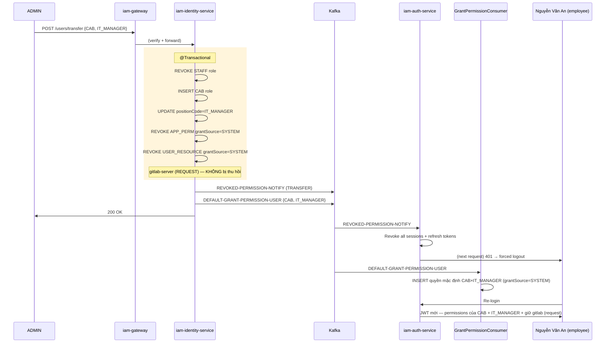

# Luồng 4: Luân chuyển vị trí (Transfer)

---

## 1. Tình huống (Scenario)

**Bối cảnh:** Nhân viên **Nguyễn Văn An** (hiện tại: IT_L2, role STAFF, mã NV: `EMP_00123`) được Hội đồng ban lãnh đạo quyết định bổ nhiệm làm **Trưởng phòng IT** (positionCode: IT_MANAGER). Đây là thay đổi vị trí quan trọng vì:

1. IT_MANAGER thuộc **nhóm CAB** — có quyền duyệt các permission request
2. Role thay từ **STAFF → CAB** — bộ quyền mặc định hoàn toàn thay đổi
3. Quyền STAFF×IT_L2 cũ phải bị thu hồi
4. Quyền CAB×IT_MANAGER mới phải được cấp tự động

**Tình huống phức tạp hơn:** An trước đây đã được CAB khác approve cho quyền GitLab (`grantSource='request'`). Theo chính sách, quyền này **không bị thu hồi** khi luân chuyển — chỉ các quyền `grantSource='system'` mới bị thu hồi cascade.

**Những người tham gia:**

| Tác nhân | Vai trò |
|---|---|
| ADMIN | Thực hiện thao tác transfer trên portal |
| Nguyễn Văn An | Nhân viên được luân chuyển |
| iam-web-service | Giao diện ADMIN (tab Luân chuyển) |
| iam-gateway | Kiểm tra quyền user-lifecycle:transfer |
| iam-identity-service | Cập nhật role/position + publish Kafka events |
| iam-auth-service | Nhận REVOKED event → invalidate sessions + tokens |
| GrantPermissionConsumer | Nhận DEFAULT-GRANT → cấp quyền mặc định CAB×IT_MANAGER |

---

## 2. Trạng thái các đối tượng

### Trước Transfer (STAFF + IT_L2)

| Entity | Trường | Giá trị |
|---|---|---|
| AUTH_USER_PROFILE | POSITION_CODE | `IT_L2` |
| AUTH_USER_PROFILE | DEPARTMENT_ID | `DEPT_IT_DEV` |
| AUTH_USER_ROLE | ROLE_ID / STATUS | `STAFF` / `ACTIVE` |
| AUTH_APP_PERMISSION | app=iam-service / GRANT_SOURCE | `ACTIVE` / `SYSTEM` |
| AUTH_APP_PERMISSION | app=change-mgmt / GRANT_SOURCE | `ACTIVE` / `SYSTEM` |
| AUTH_APP_PERMISSION | app=gitlab-server / GRANT_SOURCE | `ACTIVE` / `REQUEST` ← đặc biệt |
| AUTH_USER_RESOURCE | iam-service/user:read / GRANT_SOURCE | `ACTIVE` / `SYSTEM` |
| AUTH_USER_RESOURCE | iam-service/user-permission:create / GRANT_SOURCE | `ACTIVE` / `SYSTEM` |
| AUTH_USER_RESOURCE | change-mgmt/change-request:read,create / GRANT_SOURCE | `ACTIVE` / `SYSTEM` |
| AUTH_USER_RESOURCE | gitlab-server/* / GRANT_SOURCE | `ACTIVE` / `REQUEST` ← đặc biệt |

### Sau Transfer (CAB + IT_MANAGER)

| Entity | Trường | Giá trị |
|---|---|---|
| AUTH_USER_PROFILE | POSITION_CODE | `IT_MANAGER` |
| AUTH_USER_PROFILE | DEPARTMENT_ID | `DEPT_IT_MANAGEMENT` |
| AUTH_USER_ROLE | STAFF / STATUS | `REVOKED` ← bị thu hồi |
| AUTH_USER_ROLE | CAB / STATUS | `ACTIVE` ← mới |
| AUTH_APP_PERMISSION | iam-service / SYSTEM | `REVOKED` ← thu hồi cascade |
| AUTH_APP_PERMISSION | change-mgmt / SYSTEM | `REVOKED` ← thu hồi cascade |
| AUTH_APP_PERMISSION | **gitlab-server / REQUEST** | **`ACTIVE`** ← **ĐƯỢC GIỮ LẠI** |
| AUTH_APP_PERMISSION | iam-service / SYSTEM (CAB mặc định) | `ACTIVE` ← mới cấp |
| AUTH_APP_PERMISSION | change-mgmt / SYSTEM (CAB) | `ACTIVE` ← mới cấp |
| AUTH_USER_RESOURCE | STAFF×IT_L2 defaults / SYSTEM | `REVOKED` ← thu hồi cascade |
| AUTH_USER_RESOURCE | **gitlab-server / REQUEST** | **`ACTIVE`** ← **ĐƯỢC GIỮ LẠI** |
| AUTH_USER_RESOURCE | CAB×IT_MANAGER defaults / SYSTEM | `ACTIVE` ← mới cấp |
| AUTH_CLIENT_SESSION | — | `REVOKED` (tất cả — buộc re-login) |
| AUTH_REFRESH_TOKEN | — | `REVOKED` (tất cả) |

---

## 3. Luồng theo thời gian

```
[ADMIN — iam-web-service]
  Bước 1: Vào /users/lifecycle → Tab "Luân chuyển"
          Tìm nhân viên An (empCode: EMP_00123)
          Nhấn "Luân chuyển" → popup form
          Điền:
            roleIds      = [CAB]           ← role mới
            positionCode = IT_MANAGER      ← vị trí mới
            departmentId = DEPT_IT_MANAGEMENT
          → Nhấn Xác nhận

  Bước 2: POST /api/identity/users/transfer
          Params: ?userId=usr_abc123&employeeCode=EMP_00123
          Body: {
            roleIds: [CAB_ROLE_ID],
            positionCode: "IT_MANAGER",
            departmentId: DEPT_IT_MANAGEMENT_ID
          }

[iam-gateway]
  Bước 3: Kiểm tra "iam-service/user-lifecycle:transfer" ∈ JWT claims → OK
  Bước 4: Inject X-headers, thay service token → Forward iam-identity-service:8081

[iam-identity-service — @Transactional]
  Bước 5: Validate: userId tồn tại, status=ACTIVE

  Bước 6: Thu hồi roles cũ:
          UPDATE AUTH_USER_ROLE
            SET STATUS = 'REVOKED', UPDATED_AT = NOW()
            WHERE USER_ID = 'usr_abc123' AND STATUS = 'ACTIVE'
          → Role STAFF bị revoke

  Bước 7: Gán role mới:
          INSERT AUTH_USER_ROLE:
            (USER_ID='usr_abc123', ROLE_ID=CAB_ROLE_ID,
             STATUS='ACTIVE', CREATED_AT=NOW())

  Bước 8: Cập nhật profile:
          UPDATE AUTH_USER_PROFILE
            SET POSITION_CODE = 'IT_MANAGER',
                DEPARTMENT_ID = DEPT_IT_MANAGEMENT_ID,
                UPDATED_AT = NOW()
            WHERE USER_ID = 'usr_abc123'

  Bước 9: Thu hồi quyền SYSTEM cũ (cascade):
          UPDATE AUTH_APP_PERMISSION
            SET STATUS = 'REVOKED', UPDATED_AT = NOW()
            WHERE USER_ID = 'usr_abc123'
              AND GRANT_SOURCE = 'SYSTEM'   ← CHỈ thu hồi SYSTEM
              AND STATUS = 'ACTIVE'
          ← Quyền gitlab-server (GRANT_SOURCE='request') KHÔNG bị đụng đến

          UPDATE AUTH_USER_RESOURCE
            SET STATUS = 'REVOKED', UPDATED_AT = NOW()
            WHERE USER_ID = 'usr_abc123'
              AND GRANT_SOURCE = 'SYSTEM'   ← CHỈ thu hồi SYSTEM
              AND STATUS = 'ACTIVE'
          ← Resource gitlab-server (GRANT_SOURCE='request') KHÔNG bị thu hồi

  Bước 10: COMMIT @Transactional

  Bước 11: Kafka publish (ngoài @Transactional):

           Topic: REVOKED-PERMISSION-NOTIFY
           Payload: {
             userId: "usr_abc123",
             employeeCode: "EMP_00123",
             eventType: "TRANSFER_ROLE_REVOKE",
             revokedAt: "2026-06-07T10:00:00Z"
           }

           Topic: DEFAULT-GRANT-PERMISSION-USER
           Payload: {
             userId: "usr_abc123",
             roles: ["CAB"],
             positionCode: "IT_MANAGER",
             departmentId: DEPT_IT_MANAGEMENT_ID
           }

  Bước 12: HTTP 200 {message: "Luân chuyển thành công"}

──────────────────────────────────────
[iam-auth-service — PermissionRevokedConsumer]
──────────────────────────────────────

  Bước 13: @KafkaListener("REVOKED-PERMISSION-NOTIFY")
           eventType = "TRANSFER_ROLE_REVOKE"

  Bước 14: Revoke tất cả sessions:
           UPDATE AUTH_CLIENT_SESSION
             SET STATUS = 'REVOKED'
             WHERE USER_ID = 'usr_abc123' AND STATUS = 'ACTIVE'

  Bước 15: Revoke tất cả refresh tokens:
           UPDATE AUTH_REFRESH_TOKEN
             SET STATUS = 'REVOKED'
             WHERE USER_ID = 'usr_abc123' AND STATUS = 'ACTIVE'

  Bước 16: ack.acknowledge()

──────────────────────────────────────
[GrantPermissionConsumer — iam-identity-service]
──────────────────────────────────────

  Bước 17: @KafkaListener("DEFAULT-GRANT-PERMISSION-USER")
           {roles:["CAB"], positionCode:"IT_MANAGER"}

  Bước 18: Lookup AUTH_DEFAULT_APP_PERMISSION WHERE roleId=CAB AND positionCode=IT_MANAGER
           → Ví dụ: [iam-service, change-mgmt, log-app-service]
           (CAB có quyền xem thêm nhiều app hơn STAFF)

  Bước 19: INSERT AUTH_APP_PERMISSION (grantSource=SYSTEM) cho từng app CAB×IT_MANAGER

  Bước 20: Lookup AUTH_DEFAULT_RESOURCE WHERE roleId=CAB AND positionCode=IT_MANAGER
           → [iam-service/user:read, iam-service/user-permission:approve,reject,
              change-mgmt/change-request:read,approve,reject,
              change-mgmt/golive-job:read, ...]

  Bước 21: INSERT AUTH_USER_RESOURCE cho từng resource CAB×IT_MANAGER

  Bước 22: ack.acknowledge()

──────────────────────────────────────
[Nhân viên An — trong quá trình xử lý]
──────────────────────────────────────

  Bước 23: An đang dùng portal → request tiếp theo → 401
           interceptor: refresh → 401 (refresh token revoked)
           → authService.logout() → redirect /login
           → Thông báo: phiên đăng nhập đã hết hạn

  Bước 24: An đăng nhập lại:
           → iam-auth: STATUS=ACTIVE, role=CAB
           → Tạo JWT mới với permissions của CAB × IT_MANAGER:
             "permissions": [
               "iam-service/user:read",
               "iam-service/user-permission:read",
               "iam-service/user-permission:approve",
               "iam-service/user-permission:reject",
               "change-mgmt/change-request:read",
               "change-mgmt/change-request:approve",
               "gitlab-server/*:..."  ← vẫn còn (grantSource=request)
             ]

  Bước 25: An vào portal → sidebar hiển thị menu CAB:
           - Tab "Duyệt yêu cầu" xuất hiện (quyền approve/reject)
           - Vẫn có thể truy cập GitLab (quyền request vẫn còn)
           - Không còn menu STAFF-only features
```

---

## 4. Sơ đồ tổng quan



---

## 5. Ghi chú & Ràng buộc nghiệp vụ

| Điểm | Mô tả |
|---|---|
| **Quy tắc thu hồi cascade** | Chỉ thu hồi `grantSource='system'`. Quyền `grantSource='request'` (đã được CAB approve) là quyền cá nhân — cần thu hồi tường minh nếu muốn. |
| **Re-login bắt buộc** | Session bị invalidate ngay lập tức. Nhân viên PHẢI đăng nhập lại để có JWT với permissions mới. Không có cơ chế tự động cập nhật JWT đang active. |
| **Async grant quyền mới** | Quyền mới (CAB×IT_MANAGER) được cấp bất đồng bộ qua Kafka. Có thể mất vài giây sau khi login lại mới có đủ quyền. |
| **Luân chuyển phức tạp** | Đây là luồng phức tạp nhất vì có cả thu hồi (Kafka 1) và cấp mới (Kafka 2), xảy ra song song. |
| **Lịch sử audit** | Bảng AUTH_USER_ROLE lưu TOÀN BỘ lịch sử: cả role STAFF cũ (REVOKED) và CAB mới (ACTIVE). |
| **Position ≠ Role** | positionCode là thông tin hành chính (IT_MANAGER). Role là nhóm quyền (CAB). Mapping được cấu hình trong AUTH_DEFAULT_APP_PERMISSION và AUTH_DEFAULT_RESOURCE. |
