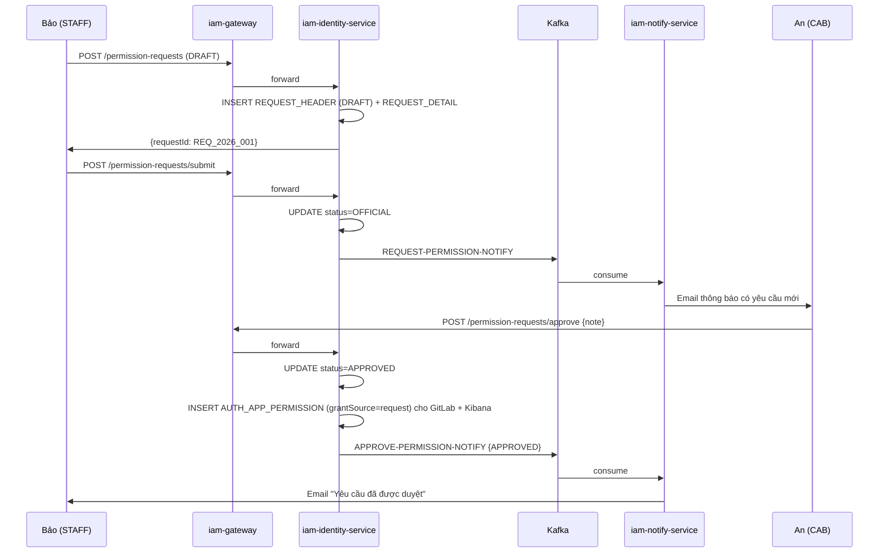

# Luồng 5: Yêu cầu phân quyền bổ sung (CAB Approval Flow)

---

## 1. Tình huống (Scenario)

**Bối cảnh:** Nhân viên **Trần Thị Bảo** (SYSADMIN, role STAFF, mã NV: `EMP_00789`) được tham gia vào dự án bảo mật nội bộ. Dự án yêu cầu Bảo có quyền truy cập **GitLab** để review code và quyền xem log trong **Kibana**. Tuy nhiên, theo cấu hình quyền mặc định, SYSADMIN không có quyền truy cập hai hệ thống này.

Quy trình: Bảo gửi **yêu cầu phân quyền bổ sung** → Hệ thống chuyển đến **IT_MANAGER Nguyễn Văn An** (CAB) để xem xét và duyệt → Sau khi được duyệt, quyền tự động được cấp.

**Tại sao cần luồng CAB approval thay vì ADMIN cấp trực tiếp?**
- Phân tách trách nhiệm (Separation of Duties): người yêu cầu không tự cấp quyền cho mình
- Đảm bảo có người chịu trách nhiệm (reviewer) cho mỗi quyền bổ sung
- Lịch sử audit đầy đủ: ai yêu cầu, ai duyệt, tại sao

**Những người tham gia:**

| Tác nhân | Vai trò | Hành động |
|---|---|---|
| Trần Thị Bảo (STAFF/SYSADMIN) | Người yêu cầu (Requester) | Tạo và gửi yêu cầu |
| Nguyễn Văn An (CAB/IT_MANAGER) | Người duyệt (Reviewer) | Xem xét, duyệt hoặc từ chối |
| iam-web-service | Giao diện cho cả 2 tác nhân | — |
| iam-gateway | Kiểm tra JWT + quyền | — |
| iam-identity-service | Xử lý luồng, cập nhật DB, publish Kafka | — |
| iam-notify-service | Gửi email thông báo | — |

---

## 2. Trạng thái các đối tượng

### Giai đoạn DRAFT (Bảo lưu nháp)

| Entity | Trường | Giá trị |
|---|---|---|
| AUTH_REQUEST_HEADER | STATUS | `DRAFT` |
| AUTH_REQUEST_HEADER | REQUESTED_BY | `usr_bao456` (userId của Bảo) |
| AUTH_REQUEST_HEADER | REQUESTER_CODE | `EMP_00789` |
| AUTH_REQUEST_HEADER | REVIEWED_BY | `usr_abc123` (userId của An) |
| AUTH_REQUEST_HEADER | REVIEWER_CODE | `EMP_00123` |
| AUTH_REQUEST_HEADER | REASON | "Tham gia dự án bảo mật nội bộ Q3/2026" |
| AUTH_REQUEST_DETAIL | APP_ID / RESOURCE_ID | gitlab-server / null, kibana / null |
| AUTH_APP_PERMISSION (gitlab) | — | Chưa tồn tại hoặc đã REVOKED |

### Giai đoạn OFFICIAL (Bảo gửi chính thức)

| Entity | Trường | Giá trị |
|---|---|---|
| AUTH_REQUEST_HEADER | STATUS | `OFFICIAL` |
| AUTH_REQUEST_HEADER | SUBMITTED_AT | `2026-06-07T14:00:00Z` |
| Kafka event | — | REQUEST-PERMISSION-NOTIFY đã được publish |

### Sau khi APPROVED (An duyệt)

| Entity | Trường | Giá trị |
|---|---|---|
| AUTH_REQUEST_HEADER | STATUS | `APPROVED` |
| AUTH_REQUEST_HEADER | REVIEWED_AT | `2026-06-07T15:30:00Z` |
| AUTH_REQUEST_HEADER | REVIEW_NOTE | "Xác nhận tham gia dự án bảo mật" |
| AUTH_APP_PERMISSION | APP_ID=gitlab / STATUS | `ACTIVE` |
| AUTH_APP_PERMISSION | GRANT_SOURCE | `request` ← quan trọng |
| AUTH_APP_PERMISSION | APP_ID=kibana / STATUS | `ACTIVE` |
| AUTH_APP_PERMISSION | GRANT_SOURCE | `request` |

### Sau khi REJECTED (An từ chối)

| Entity | Trường | Giá trị |
|---|---|---|
| AUTH_REQUEST_HEADER | STATUS | `REJECTED` |
| AUTH_REQUEST_HEADER | REVIEW_NOTE | "Không đủ lý do nghiệp vụ" |
| AUTH_APP_PERMISSION | — | Không thay đổi (không được cấp) |

---

## 3. Luồng theo thời gian

```
────────────────────────────────────────────
[PHẦN 1: Bảo tạo và gửi yêu cầu]
────────────────────────────────────────────

[Trần Thị Bảo — iam-web-service]
  Bước 1: Vào /users/permissions → Tab "Danh sách yêu cầu"
          Nhấn FAB "+" → navigate /users/permissions/create

  Bước 2: Điền form yêu cầu:
            Reviewer   : Nguyễn Văn An (tìm theo empCode: EMP_00123, CAB)
            Lý do      : "Tham gia dự án bảo mật nội bộ Q3/2026, cần review code và monitor log"
            Ứng dụng 1 : GitLab  (chọn từ dropdown app list)
            Ứng dụng 2 : Kibana  (chọn từ dropdown)
          → Nhấn "Lưu nháp"

  Bước 3: POST /api/identity/permission-requests
          Authorization: Bearer <BAO_ACCESS_TOKEN>
          Body: {
            type: "DRAFT",
            requesterId: "usr_bao456",
            requester: "Trần Thị Bảo",
            requesterCode: "EMP_00789",
            reviewer: "Nguyễn Văn An",
            reviewerCode: "EMP_00123",
            reason: "Tham gia dự án bảo mật nội bộ Q3/2026...",
            apps: [
              {appId: GITLAB_APP_ID, appName: "GitLab"},
              {appId: KIBANA_APP_ID, appName: "Kibana"}
            ],
            resources: []
          }

[iam-gateway]
  Bước 4: Kiểm tra "iam-service/user-permission:create" ∈ JWT → OK
  Bước 5: Forward iam-identity-service:8081

[iam-identity-service]
  Bước 6: INSERT AUTH_REQUEST_HEADER:
           (REQUEST_ID=REQ_2026_001, STATUS='DRAFT',
            REQUESTED_BY='usr_bao456', REQUESTER_CODE='EMP_00789',
            REVIEWED_BY='usr_abc123', REVIEWER_CODE='EMP_00123',
            REASON='Tham gia dự án bảo mật...', CREATED_AT=NOW())

  Bước 7: INSERT AUTH_REQUEST_DETAIL × 2:
           (REQUEST_ID=REQ_2026_001, APP_ID=GITLAB_APP_ID, RESOURCE_ID=null)
           (REQUEST_ID=REQ_2026_001, APP_ID=KIBANA_APP_ID, RESOURCE_ID=null)

  Bước 8: HTTP 200 {requestId: "REQ_2026_001", status: "DRAFT"}

[Bảo] → Xem yêu cầu vừa tạo (status: DRAFT)
        → Kiểm tra thông tin, sửa nếu cần
        → Nhấn "Gửi yêu cầu"

  Bước 9: POST /api/identity/permission-requests/submit
          Body: {requestId: "REQ_2026_001",
                 submiter: "Trần Thị Bảo", submitCode: "EMP_00789"}

[iam-identity-service]
  Bước 10: UPDATE AUTH_REQUEST_HEADER
            SET STATUS = 'OFFICIAL',
                SUBMITTED_AT = NOW()
            WHERE REQUEST_ID = 'REQ_2026_001'

  Bước 11: Kafka publish:
           Topic: REQUEST-PERMISSION-NOTIFY
           Payload: {
             requestId: "REQ_2026_001",
             requesterCode: "EMP_00789",
             requester: "Trần Thị Bảo",
             reviewerCode: "EMP_00123",
             reason: "Tham gia dự án bảo mật...",
             requestedAt: "2026-06-07T14:00:00Z",
             apps: ["GitLab", "Kibana"]
           }

  Bước 12: HTTP 200

────────────────────────────────────────────
[iam-notify-service — NotifyConsumer]
────────────────────────────────────────────

  Bước 13: @KafkaListener("REQUEST-PERMISSION-NOTIFY")
           Lookup email của reviewer (An): emailPersonal từ AUTH_USER_PROFILE
           → an.nguyen@gmail.com

  Bước 14: EmailService.sendPermissionRequestEmail()
           → Thymeleaf: permission-request.html
             Nội dung: "Có yêu cầu phân quyền mới cần bạn xem xét
                        Người yêu cầu: Trần Thị Bảo (EMP_00789)
                        App: GitLab, Kibana
                        Lý do: Tham gia dự án bảo mật...
                        Link xem xét: http://iam.bank.vn/users/permissions"
           → To: an.nguyen@gmail.com
           → CC: vudinhcuong8404@gmail.com

────────────────────────────────────────────
[PHẦN 2: An xem xét và quyết định]
────────────────────────────────────────────

[Nguyễn Văn An (CAB) — iam-web-service]
  Bước 15: Nhận email thông báo → vào portal IAM
           /users/permissions → Tab "Duyệt yêu cầu"
           Xem danh sách: filter reviewed_by = current user (An)
           → Thấy REQ_2026_001 của Bảo (status: OFFICIAL)

  Bước 16: Click vào REQ_2026_001 → xem chi tiết
           (navigate /users/permissions/detail?requestId=REQ_2026_001)
           Thông tin: requester, reason, apps cần xin, ngày gửi

TRƯỜNG HỢP 2A: An duyệt (APPROVE)
──────────────────────────────────

  Bước 17a: Nhấn "Duyệt" → confirm dialog
            Điền ghi chú: "Xác nhận tham gia dự án bảo mật, hạn 31/08/2026"
            → Xác nhận

  Bước 18a: POST /api/identity/permission-requests/approve
            Body: {requestId: "REQ_2026_001", note: "Xác nhận tham gia dự án bảo mật..."}

[iam-identity-service]
  Bước 19a: UPDATE AUTH_REQUEST_HEADER
             SET STATUS = 'APPROVED',
                 REVIEWED_AT = NOW(),
                 REVIEW_NOTE = 'Xác nhận tham gia dự án bảo mật...'
             WHERE REQUEST_ID = 'REQ_2026_001'

  Bước 20a: Đọc AUTH_REQUEST_DETAIL WHERE REQUEST_ID = 'REQ_2026_001'
            → [GITLAB_APP_ID, KIBANA_APP_ID]

  Bước 21a: INSERT AUTH_APP_PERMISSION:
            (USER_ID='usr_bao456', APP_ID=GITLAB_APP_ID,
             STATUS='ACTIVE', GRANT_SOURCE='request',   ← QUAN TRỌNG
             GRANTED_AT=NOW(), GRANTED_BY='usr_abc123')

            (USER_ID='usr_bao456', APP_ID=KIBANA_APP_ID,
             STATUS='ACTIVE', GRANT_SOURCE='request',
             GRANTED_AT=NOW(), GRANTED_BY='usr_abc123')

  Bước 22a: Kafka publish:
            Topic: APPROVE-PERMISSION-NOTIFY
            Payload: {
              requestId: "REQ_2026_001",
              action: "APPROVED",
              requestedBy: "EMP_00789",
              reviewedBy: "EMP_00123",
              note: "Xác nhận tham gia dự án..."
            }

  Bước 23a: HTTP 200

TRƯỜNG HỢP 2B: An từ chối (REJECT)
────────────────────────────────────

  Bước 17b: Nhấn "Từ chối" → nhập lý do
            "Không có nhu cầu nghiệp vụ cụ thể, liên hệ Project Manager để xác nhận"

  Bước 18b: POST /api/identity/permission-requests/reject
            Body: {requestId: "REQ_2026_001", note: "Không có nhu cầu nghiệp vụ..."}

[iam-identity-service]
  Bước 19b: UPDATE AUTH_REQUEST_HEADER
             SET STATUS = 'REJECTED',
                 REVIEWED_AT = NOW(),
                 REVIEW_NOTE = 'Không có nhu cầu nghiệp vụ...'
             WHERE REQUEST_ID = 'REQ_2026_001'

  Bước 20b: Kafka: APPROVE-PERMISSION-NOTIFY {action: "REJECTED"}
            (Không INSERT thêm quyền gì)

────────────────────────────────────────────
[iam-notify-service — gửi kết quả về Bảo]
────────────────────────────────────────────

  Bước 24: @KafkaListener("APPROVE-PERMISSION-NOTIFY")
           Lookup email của requester Bảo: emailPersonal từ AUTH_USER_PROFILE

  Bước 25 (nếu APPROVED): EmailService.sendPermissionApprovedEmail()
           → Template: permission-approved.html
             Nội dung: "Yêu cầu phân quyền của bạn đã được DUYỆT
                        App: GitLab, Kibana
                        Người duyệt: Nguyễn Văn An
                        Ghi chú: Xác nhận tham gia dự án..."
           → To: bao.tran@gmail.com, CC: admin

  Bước 25 (nếu REJECTED): EmailService.sendPermissionRejectedEmail()
           → Nội dung: "Yêu cầu bị từ chối. Lý do: Không có nhu cầu nghiệp vụ..."

────────────────────────────────────────────
[Trần Thị Bảo — sau khi được duyệt]
────────────────────────────────────────────

  Bước 26: Bảo login lại (hoặc chờ token refresh)
           → JWT mới sẽ có thêm:
             "permissions": [
               ..., (quyền STAFF×SYSADMIN cũ)
               "gitlab-server/...",   ← quyền mới (grantSource=request)
               "kibana/..."           ← quyền mới (grantSource=request)
             ]

  Bước 27: Bảo truy cập GitLab:
           → Browser → gitlab.bank.vn
           → GitLab: LDAP BIND với credentials IAM
           → ldap-server: check AUTH_APP_PERMISSION (gitlab-server, usr_bao456) → ACTIVE
           → Đăng nhập thành công

  Bước 28: Bảo truy cập Kibana:
           → Browser → kibana.bank.vn
           → Kibana: LDAP BIND → ldap-server check → ACTIVE → Đăng nhập
```

---

## 4. Sơ đồ tổng quan



---

## 5. Ghi chú & Ràng buộc nghiệp vụ

| Điểm | Mô tả |
|---|---|
| **grantSource='request'** | Đây là dấu hiệu phân biệt quyền do CAB approve. Khi Bảo luân chuyển vị trí, SYSTEM perms bị revoke cascade nhưng 'request' perms được giữ lại. |
| **Chỉ CAB mới được duyệt** | Chỉ user có role CAB mới thấy tab "Duyệt yêu cầu" và gọi được API approve/reject (được kiểm soát bởi JWT permission `user-permission:approve`). |
| **DRAFT → OFFICIAL** | Request DRAFT chỉ có thể edit/cancel. Sau khi OFFICIAL mới trigger email + không thể sửa. |
| **Backend scoped theo user** | API `GET /permission-requests` chỉ trả về request của người đang login (hoặc request họ là reviewer). Không xem được request của người khác. |
| **Revoke lại quyền đã approve** | Nếu dự án kết thúc, ADMIN dùng luồng Thu hồi quyền (luồng 6) để revoke tường minh. Không có auto-expire. |
| **CAB có thể là nhiều người** | Không có giới hạn 1 CAB. Nhưng mỗi request chỉ có 1 reviewer. Reviewer được chọn bởi Requester. |
| **STAFF tự chọn reviewer** | Thiết kế này dựa trên niềm tin: STAFF biết ai là CAB phụ trách domain của mình. Tương lai có thể thêm validation "reviewer phải là CAB phụ trách app được xin". |
