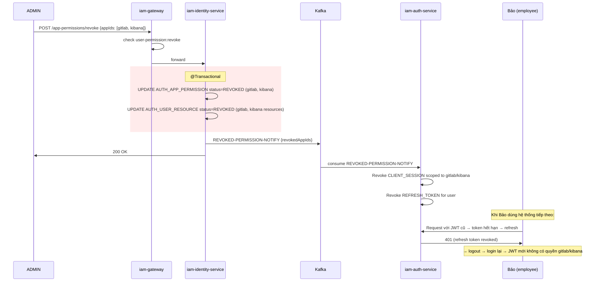

# Luồng 6: Thu hồi quyền (Permission Revocation)

---

## 1. Tình huống (Scenario)

Luồng thu hồi quyền có **hai trường hợp** khác nhau về nguồn gốc:

### Trường hợp A: Thu hồi tường minh (Direct Revoke)

**Bối cảnh:** Dự án bảo mật Q3/2026 kết thúc. Nhân viên **Trần Thị Bảo** (SYSADMIN) không còn cần quyền truy cập GitLab và Kibana nữa. ADMIN thu hồi những quyền này trực tiếp.

**Đặc điểm:** Không phân biệt `grantSource` — ADMIN có thể thu hồi bất kỳ quyền nào, kể cả quyền đã được CAB approve (`grantSource='request'`).

### Trường hợp B: Thu hồi cascade khi thay đổi role (Role-based Cascade)

**Bối cảnh:** Nhân viên **Lê Văn Cường** (IT_L1, STAFF) được luân chuyển sang vị trí mới (IT_L2). Khi role cũ bị revoke, tất cả quyền `grantSource='system'` được cấp theo role đó cũng tự động bị thu hồi. Quyền `grantSource='request'` (đã được CAB approve) được **bảo lưu**.

Trường hợp B này thực ra là một phần của luồng Transfer (luồng 4), tài liệu hóa ở đây để làm rõ cơ chế phân biệt grantSource.

**Những người tham gia:**

| Tác nhân | Vai trò |
|---|---|
| ADMIN | Thực hiện thu hồi quyền (Case A) |
| iam-web-service | Giao diện ADMIN (Tab "Danh sách quyền") |
| iam-gateway | Kiểm tra quyền user-permission:revoke |
| iam-identity-service | Cập nhật DB + publish Kafka |
| iam-auth-service | Nhận event → invalidate sessions/tokens (buộc logout) |
| Trần Thị Bảo / Lê Văn Cường | Bị ảnh hưởng — mất quyền truy cập |

---

## 2. Trạng thái các đối tượng

### Trường hợp A: Thu hồi tường minh (Bảo mất quyền GitLab + Kibana)

| Entity | Trường | Trước | Sau |
|---|---|---|---|
| AUTH_APP_PERMISSION (gitlab) | STATUS | `ACTIVE` | `REVOKED` |
| AUTH_APP_PERMISSION (gitlab) | GRANT_SOURCE | `request` | `request` (không đổi) |
| AUTH_APP_PERMISSION (kibana) | STATUS | `ACTIVE` | `REVOKED` |
| AUTH_USER_RESOURCE (gitlab resources) | STATUS | `ACTIVE` | `REVOKED` |
| AUTH_USER_RESOURCE (kibana resources) | STATUS | `ACTIVE` | `REVOKED` |
| AUTH_CLIENT_SESSION | STATUS | `ACTIVE` | `REVOKED` (tất cả) |
| AUTH_REFRESH_TOKEN | STATUS | `ACTIVE` | `REVOKED` (tất cả) |

### Trường hợp B: Thu hồi cascade khi transfer (Cường thay role)

| Entity | Trường | Grant Source | Trước | Sau |
|---|---|---|---|---|
| AUTH_APP_PERMISSION (iam-service) | STATUS | `system` | `ACTIVE` | `REVOKED` ← bị thu hồi |
| AUTH_APP_PERMISSION (change-mgmt) | STATUS | `system` | `ACTIVE` | `REVOKED` ← bị thu hồi |
| AUTH_APP_PERMISSION (gitlab) | STATUS | `request` | `ACTIVE` | **`ACTIVE`** ← **giữ nguyên** |
| AUTH_USER_RESOURCE (IT_L1 defaults) | STATUS | `system` | `ACTIVE` | `REVOKED` ← bị thu hồi |
| AUTH_USER_RESOURCE (gitlab resources) | STATUS | `request` | `ACTIVE` | **`ACTIVE`** ← **giữ nguyên** |

---

## 3. Luồng theo thời gian

### 3A. Thu hồi tường minh (Direct Revoke)

```
[ADMIN — iam-web-service]
  Bước 1: Vào /users/permissions → Tab "Danh sách quyền"
          Sub-tab "Quyền ứng dụng"
          Tìm nhân viên Bảo (filter by empCode: EMP_00789)
          Xem bảng quyền ứng dụng của Bảo:
            - iam-service (ACTIVE/SYSTEM)
            - change-mgmt (ACTIVE/SYSTEM)
            - gitlab-server (ACTIVE/REQUEST)  ← muốn thu hồi
            - kibana (ACTIVE/REQUEST)          ← muốn thu hồi

  Bước 2: Chọn checkbox gitlab-server và kibana
          Nhấn "Thu hồi quyền" → confirm dialog
          Điền lý do: "Dự án bảo mật Q3/2026 kết thúc"

  Bước 3: POST /api/identity/users/app-permissions/revoke
          Body: {
            empCode: "EMP_00789",
            appIds: [GITLAB_APP_ID, KIBANA_APP_ID],
            reason: "Dự án bảo mật Q3/2026 kết thúc"
          }

[iam-gateway]
  Bước 4: Kiểm tra "iam-service/user-permission:revoke" ∈ JWT → OK
  Bước 5: Forward iam-identity-service:8081

[iam-identity-service — @Transactional]
  Bước 6: Lookup userId từ empCode = 'EMP_00789' → usr_bao456

  Bước 7: UPDATE AUTH_APP_PERMISSION
            SET STATUS = 'REVOKED', UPDATED_AT = NOW()
            WHERE USER_ID = 'usr_bao456'
              AND APP_ID IN (GITLAB_APP_ID, KIBANA_APP_ID)
              AND STATUS = 'ACTIVE'
          → 2 records bị revoke (gitlab + kibana)
          Note: KHÔNG lọc theo grantSource — ADMIN có thể revoke mọi loại

  Bước 8: UPDATE AUTH_USER_RESOURCE
            SET STATUS = 'REVOKED', UPDATED_AT = NOW()
            WHERE USER_ID = 'usr_bao456'
              AND APP_ID IN (GITLAB_APP_ID, KIBANA_APP_ID)
              AND STATUS = 'ACTIVE'
          → Revoke các resource permission gắn với gitlab/kibana

  Bước 9: COMMIT

  Bước 10: Kafka publish:
           Topic: REVOKED-PERMISSION-NOTIFY
           Payload: {
             userId: "usr_bao456",
             employeeCode: "EMP_00789",
             revokedAppIds: [GITLAB_APP_ID, KIBANA_APP_ID],
             eventType: "REVOKED_APP_PERMISSION",
             reason: "Dự án bảo mật Q3/2026 kết thúc",
             revokedBy: "admin_system_dev",
             revokedAt: "2026-09-01T09:00:00Z"
           }

  Bước 11: HTTP 200

──────────────────────────────────────
[iam-auth-service — PermissionRevokedConsumer]
──────────────────────────────────────

  Bước 12: @KafkaListener("REVOKED-PERMISSION-NOTIFY")
           eventType = "REVOKED_APP_PERMISSION"
           revokedAppIds = [GITLAB_APP_ID, KIBANA_APP_ID]

  Bước 13: Revoke CLIENT SESSION scoped tới app bị thu hồi:
           UPDATE AUTH_CLIENT_SESSION
             SET STATUS = 'REVOKED'
             WHERE USER_ID = 'usr_bao456'
               AND CLIENT_ID IN (
                 SELECT CLIENT_ID FROM AUTH_CLIENT
                 WHERE APP_ID IN (GITLAB_APP_ID, KIBANA_APP_ID)
               )
               AND STATUS = 'ACTIVE'

  Bước 14: Revoke REFRESH TOKEN của user:
           UPDATE AUTH_REFRESH_TOKEN
             SET STATUS = 'REVOKED'
             WHERE USER_ID = 'usr_bao456'
               AND STATUS = 'ACTIVE'

  Bước 15: ack.acknowledge()

──────────────────────────────────────
[Tác động đến Trần Thị Bảo]
──────────────────────────────────────

  Kịch bản 1 — Bảo đang dùng portal IAM:
  Bước 16a: Request API tiếp theo → Gateway check JWT
            JWT cũ vẫn còn valid (chưa hết TTL 1h)
            Nhưng khi JWT hết hạn → interceptor gọi refresh
            → POST /auth/token (refresh_token=...) → 401 (refresh revoked)
            → authService.logout() → redirect /login

  Kịch bản 2 — Bảo đang dùng GitLab (LDAP):
  Bước 16b: Bảo thực hiện git push, GitLab cần re-verify
            → LDAP BIND lại → ldap-server:
              SELECT * FROM AUTH_APP_PERMISSION
              WHERE USER_ID='usr_bao456' AND SERVICE_CODE='gitlab-server'
              AND STATUS='ACTIVE'
            → Không có record ACTIVE → InvalidCredentialsException
            → GitLab: "LDAP authentication failed"

  Kịch bản 3 — Bảo login lại portal IAM sau khi logout:
  Bước 16c: iam-auth sinh JWT mới
            permissions claim KHÔNG còn:
              "gitlab-server/...", "kibana/..."
            → Nếu cố access route cần gitlab perm → gateway 403 FORBIDDEN
```

### 3B. Thu hồi cascade theo grantSource (khi Transfer)

```
Đây là phần xảy ra bên trong luồng Transfer (luồng 4 — bước 9).

[iam-identity-service — trong @Transactional của Transfer]

  Bước A: Thu hồi CHỈ quyền grantSource='system':
          UPDATE AUTH_APP_PERMISSION
            SET STATUS = 'REVOKED', UPDATED_AT = NOW()
            WHERE USER_ID = 'usr_xyz789'    ← Lê Văn Cường
              AND GRANT_SOURCE = 'system'   ← lọc theo nguồn gốc
              AND STATUS = 'ACTIVE'

          UPDATE AUTH_USER_RESOURCE
            SET STATUS = 'REVOKED', UPDATED_AT = NOW()
            WHERE USER_ID = 'usr_xyz789'
              AND GRANT_SOURCE = 'system'
              AND STATUS = 'ACTIVE'

  Bước B: Quyền grantSource='request' KHÔNG bị thu hồi:
          → AUTH_APP_PERMISSION (gitlab, GRANT_SOURCE='request') → STATUS vẫn ACTIVE
          → AUTH_USER_RESOURCE (gitlab resources, GRANT_SOURCE='request') → STATUS vẫn ACTIVE

  Kết quả:
  Sau Transfer, Cường vẫn có thể truy cập GitLab
  (nếu trước đó đã được CAB approve)
  Chỉ mất quyền mặc định của role STAFF cũ.
```

---

## 4. Sơ đồ tổng quan — Thu hồi tường minh



---

## 5. So sánh hai loại thu hồi

| Tiêu chí | Thu hồi tường minh (ADMIN) | Thu hồi cascade (Transfer) |
|---|---|---|
| **Ai thực hiện** | ADMIN chủ động | Tự động khi thay đổi role |
| **Scope** | Tất cả (bất kể grantSource) | Chỉ `grantSource='system'` |
| **Quyền REQUEST bị ảnh hưởng** | Có (ADMIN có toàn quyền) | Không (được bảo vệ) |
| **Kafka event** | REVOKED-PERMISSION-NOTIFY | REVOKED-PERMISSION-NOTIFY |
| **Session invalidation** | Có (ngay lập tức) | Có (ngay lập tức) |
| **Ví dụ sử dụng** | Dự án kết thúc, vi phạm bảo mật | Luân chuyển vị trí, đổi role |

---

## 6. Ghi chú & Ràng buộc nghiệp vụ

| Điểm | Mô tả |
|---|---|
| **Không hard-delete** | AUTH_APP_PERMISSION được UPDATE STATUS='REVOKED', không bị xóa. Đảm bảo audit trail: biết ai từng có quyền gì. |
| **Session invalidation không tức thì** | JWT hiện tại vẫn valid cho đến khi hết TTL (1h). Chỉ khi refresh token bị revoke, người dùng mới thực sự bị "bật ra". Nếu cần revoke tức thì, cần JTI blacklist trong Redis (cơ chế đã có). |
| **LDAP revoke tức thì hơn** | GitLab/Kibana LDAP bind check AUTH_APP_PERMISSION mỗi lần bind → revoke có hiệu lực ngay khi GitLab hết session timeout (thường 30 phút). |
| **grantSource là khóa then chốt** | Toàn bộ cơ chế cascade revoke dựa vào trường `GRANT_SOURCE`. Việc phân biệt 'system' vs 'request' cho phép bảo vệ quyền đã được CAB phê duyệt qua quy trình chính thức. |
| **Revoke resource vs app** | Có thể revoke theo app (sẽ revoke cả resource của app đó) hoặc theo từng resource cụ thể. API hỗ trợ cả hai endpoint. |
